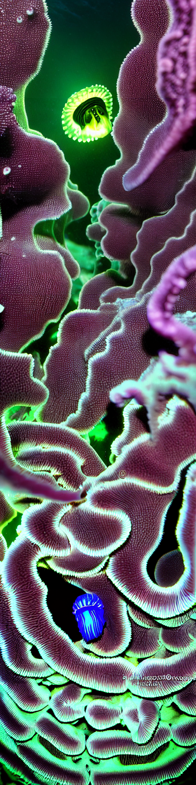
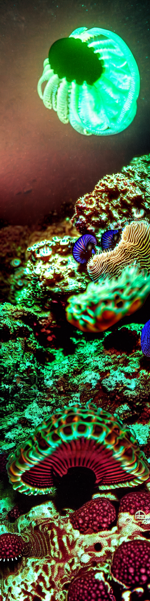
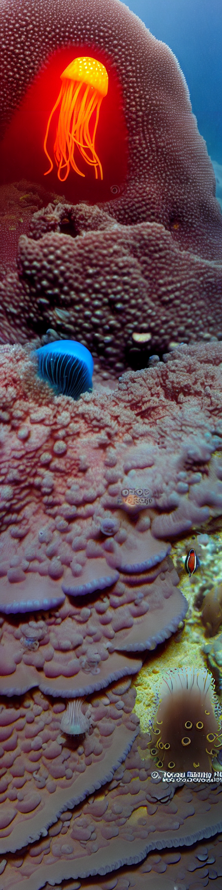
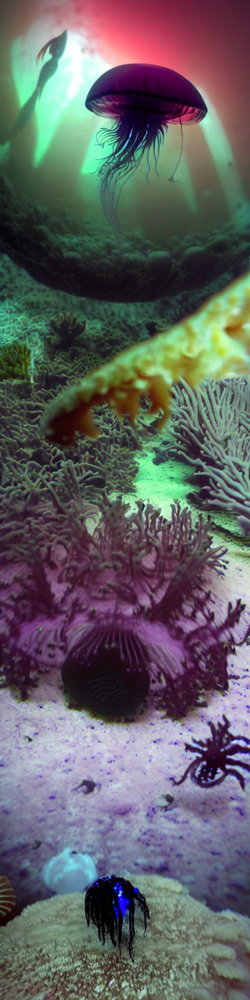
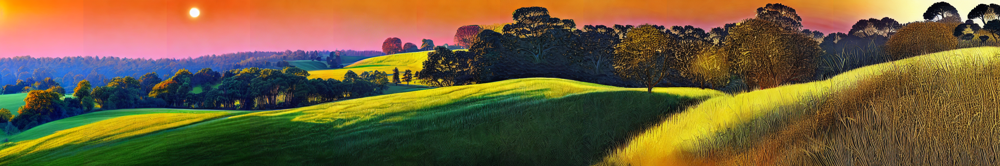

# Stable Diffusion Infinite Scroll
A Tkinter app which uses Stable Diffusion inpainting to endlessly scroll through dynamically generated content.
The image is continuously extended using inpainting.

<p align="center">
  
</p>
(this GIF is a heavily compressed screen recording of the app)

## Requirements
 - CUDA-enabled GPU capable of running Stable Diffusion.
 - `requirements.txt` for Python requirements.

## Usage
First, pull:
```
git clone git@github.com:zzbuzzard/stable-diffusion-infinite-scroll.git
```
and install the dependencies (probably in a virtual environment).

There are two scripts in this project: `sd_scroll` (for the scrolling app) and `long_image` (to generate very wide/high
images using inpainting).
### Scroller
```
python sd_scroll.py [prompts] -s [number of steps] -d [H for horizontal or V for vertical]
```
Will start the full-screen scroller app, which will extend the starting image forever (until stopped by pressing `Esc`).

For example,
```
python sd_scroll.py "fantasy mushroom forest|peaceful landscape" -s 40 -d H
```
Note that prompts are separated by `|`, and surrounded by `"`.
There are various other arguments (e.g. CFG, negative prompt, starting image), see `--help` for full details.

You can also choose the Stable Diffusion model to be used via the `-m` flag. By default, HuggingFace's
`runwayml/stable-diffusion-inpainting` is used, but you could also use `stabilityai/stable-diffusion-2-inpainting` or
any local model. I recommend using a specialised inpainting model.


### Long Image Generation
```
python long_image.py [prompts] -s [number of steps] -d [H for horizontal or V for vertical] -out [output path] -n [number of shifts]
```
Most arguments are shared between the two scripts, see `--help` for full details.

For example,
```
python long_image.py "deep ocean life, deep sea photography, dark, jellyfish, bioluminescence, underwater, barren" -s 40 -d V -cfg 12 -out test.png -n 6
```
was used to generate the following 512 x 2048 images:

<p align="middle">
  
  
  
  
</p>

### Tips
 - A starting image can be provided. If not, it is generated using SD.
   - Note that the app will show a black screen until the first images are generated, see the console for details.
 - If you run out of VRAM, try enabling the `-as` flag (attention slicing) or using a lower resolution (`-r` flag).
   - Everything was tested locally on a RTX 3060 Laptop GPU (6GB VRAM).
 - Reducing the number of steps (`-s`) can lead to really fast scrolling.
 - If you want to leave the scroller on for a long time, try using `-spd` with a value less than 1; this will cause the scroller to move slower but give the GPU regular breaks to prevent excessive heat.
 - Vertical and horizontal scrolling is supported (`-d H` or `-d V`).

## Other examples
```
python sd_scroll.py "3D intricate structure, modern art sculpture, intricate, complementary colours, HD digital render" -s 40 -d H -cfg 12 -r 640 -as
```
I had to use `-as` for this one to reduce VRAM usage at the higher resolution of 640.
<p align="center">
  
</p>

```
python long_image.py "beautiful rolling hills, peaceful landscape, blue sky, intricate detail, trees, sunrise" -s 40 -d H -cfg 12 -out test.png -n 10
```
<p align="center">
  
</p>
